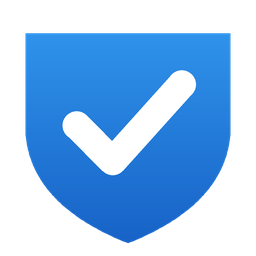

<p align="center">
  
</p>

# SoftwareComplianceChecker

[](https://github.com/phuongdmp7/SoftwareComplianceChecker/actions/workflows/ci.yml)

A lightweight Windows desktop application that audits a workstation against a configurable software compliance policy and produces a professional report.

It runs entirely offline, needs no installation, and ships as a single self-contained executable.

> **Status: implemented, pending validation on Windows.** The solution builds clean and all unit tests pass, but the application has not yet been run on a Windows machine. The UI, the live registry and WMI scans, and the published executable are unverified against real hardware. See [docs/implementation-plan.md](docs/implementation-plan.md).

## What it does

The app scans the local machine across three areas and reports each finding as either PASS or FAIL:

- **Windows license** — determines whether Windows appears to be legitimately activated. Because KMS-activated systems report themselves as activated, the scanner collects corroborating evidence (activation channel, OEM BIOS key, activation expiry, KMS server configuration, traces of activation tools) rather than reading a single status flag.
- **Installed software** — enumerated from the registry uninstall keys across `HKLM`, `HKCU`, and `WOW6432Node`.
- **Portable software** — commercial applications run without installation, found by scanning a configurable set of folders.

Results are shown in a dark-themed dashboard with search, filtering, and expandable rows, and can be exported to HTML, CSV, or JSON.

## Compliance model

There are two states: PASS and FAIL. There is no warning state.

The app checks presence against an internal policy. It does **not** attempt to determine software ownership, licensing status, or piracy — presence of a prohibited item is sufficient to fail, and software matching no rule passes.

Prohibited by default: Adobe, JetBrains, Autodesk, Marmoset, Microsoft Office (any edition), and WinRAR. Unity, Visual Studio, VS Code, Android Studio, Blender, Git, 7-Zip and similar tools pass.

## Configuration

Policy is data, not code. Three files sit next to the executable and can be edited without recompiling:

| File | Purpose |
| --- | --- |
| `rules.json` | Compliance rules — category, match type, publisher, aliases, priority, status, reason |
| `portableFolders.json` | Folders searched for portable software |
| `appsettings.json` | Application settings |

Adding new prohibited software means adding a rule to `rules.json`. Matching is case-insensitive and supports contains, starts-with, ends-with, and regex.

Logs are written to `logs/yyyy-MM-dd.log`.

## Requirements

- Windows 10 or Windows 11
- .NET 8 SDK to build (the published executable is self-contained and needs no runtime installed)

## Building

```powershell
dotnet restore
dotnet build -c Release
dotnet test

# Single-file self-contained executable
dotnet publish src/SoftwareComplianceChecker.App -p:PublishProfile=win-x64
```

The published output is `SoftwareComplianceChecker.exe` alongside the three configuration files. Copy the folder anywhere and run it; no installation and no .NET runtime are required.

## Tech stack

C# · .NET 8 · WPF · MVVM · Microsoft.Extensions.DependencyInjection · MaterialDesignThemes

Clean Architecture across five projects:

```
Core ← Rules ← Scanning ← Export ← App (WPF)
```

`Core` holds the domain and the abstractions and depends on nothing. Scanners detect; a separate rule engine decides compliance. All Windows API access sits behind interfaces, so the decision logic is unit tested without a Windows machine.

## License

MIT — see [LICENSE](LICENSE).
